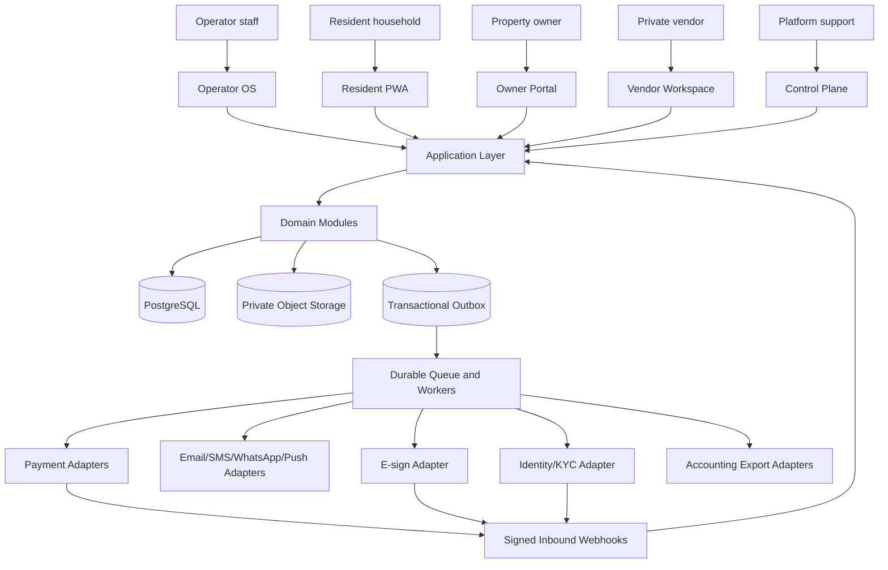

# Product and System Architecture Specification

**Document owner:** Principal Engineering  
**Approval state:** Implementation-ready after Gate 0 decisions  
**Architecture style:** Multi-tenant modular monolith with transactional events  
**Primary stack:** Next.js, TypeScript, PostgreSQL/Supabase, private object storage, durable queues

---

## 1. Executive architecture decision

Build one connected B2B2C rental operating platform. The operator is the commercial customer and the administrative authority for its organization. Residents, owners, and private vendors interact through limited, purpose-built surfaces linked to the same canonical operational record.

The system must optimize for three launch outcomes:

1. An operator can migrate an existing portfolio and manage it without spreadsheets.
2. A resident can understand, pay, document, and resolve housing obligations without calling management for routine tasks.
3. An owner can understand property performance and operator actions without receiving unrestricted resident data.

The system must preserve seams for future rental and vendor networks, but network liquidity, public ranking, marketplace payments, and financial risk products are explicitly outside launch scope.

## 2. Architecture qualities and priorities

The priority order is intentional:

1. **Correct financial and legal history**
2. **Tenant isolation and least privilege**
3. **Operator workflow completeness**
4. **Resident clarity and accessibility**
5. **Auditability and supportability**
6. **Reliable integrations and recovery**
7. **Performance within defined workload envelope**
8. **Future extensibility**
9. **Implementation speed**

When priorities conflict, higher-ranked qualities win. For example, a slower explicit financial command is preferable to a fast generic record edit.

## 3. Product surfaces

### 3.1 Operator OS

The paid administrative product. It owns organization configuration and provides full operational workflows for portfolio, people, leasing, rent, reconciliation, maintenance, inspections, ownership, statements, communication, reports, imports, and support.

### 3.2 Resident experience

A mobile-first PWA for the resident’s own household and tenancy. It exposes due amounts, payment options, receipts, lease documents, notices, maintenance, messages, renewal, and move-out. It is not a reduced operator dashboard.

### 3.3 Owner portal

A read-heavy and approval-oriented product. It exposes only properties and financial interests associated with that owner, including occupancy, statement snapshots, expenses, approvals, inspection evidence, and remittance history.

### 3.4 Private vendor workspace

An invitation-only work surface for jobs assigned by an operator. A vendor sees assigned work, scheduling, property access instructions, quotes, messages, evidence, and completion status. No public vendor discovery exists at launch.

### 3.5 Platform control plane

An internal support and operations product. It provides organization lookup, subscription health, import jobs, webhook diagnostics, queue diagnostics, support sessions, feature flags, incident timeline, and audited impersonation. It must not bypass domain commands for ordinary support operations.

## 4. Launch scope contract

### Required launch capabilities

- Organization creation, trial, subscription, entitlements, and limits
- Staff invitations, roles, property scopes, MFA, and offboarding
- Properties, buildings, units, occupancy, owners, and management agreements
- Residents, households, applicants, guarantors, and relationships
- Lease generation, signatures, amendments, renewals, notices, move-in, and move-out
- Recurring schedules, charges, ledger entries, payments, allocations, receipts, deposits, credits, reversals, and write-offs
- Payment-provider webhooks, manual payment recording, settlement import, and reconciliation exceptions
- Maintenance requests, triage, work orders, private vendors, scheduling, evidence, costs, and approvals
- Inspections with versioned checklists, evidence, comparison, and signatures
- Owner statements, approvals, reserve tracking, payable calculation, and remittance records
- Conversations, announcements, notifications, preferences, and delivery status
- Shareable vacancy pages, inquiry capture, and direct application conversion
- Bulk import and export
- Operational reporting and immutable statement/report snapshots where required
- Support tooling, audit history, observability, backup, and incident controls

### Explicitly deferred

- Aggregated public rental marketplace
- Public vendor discovery, bidding, ratings, and commissions
- Platform custody of pooled rent
- Lending, insurance underwriting, guarantees, or deposit replacement
- Cross-operator renter identity or reputation
- Automated revenue optimization
- Institutional investment accounting
- Full native mobile applications

## 5. System context



## 6. Deployment architecture

### 6.1 Initial topology

- One Next.js application deployment containing role-specific route groups and server-side command/query handlers
- One PostgreSQL database per environment
- One private object-storage namespace per environment
- One durable queue subsystem
- One worker deployment, logically separated from request-serving application code
- One observability pipeline
- One secrets manager and environment-variable policy

### 6.2 Environments

- Local development
- Preview/test
- Staging
- Production

Production data, storage, payment credentials, webhooks, and messaging credentials must never be shared with non-production environments.

### 6.3 Extraction triggers

A module may be extracted from the monolith only when at least one trigger is met and an ADR is approved:

- Independent scaling needs exceed the primary application by at least 5x
- A background workload threatens interactive SLOs despite queue isolation
- A security or compliance boundary requires separate deployment
- A team owns the domain independently and release coupling materially slows delivery
- A provider integration requires a distinct runtime or regional deployment

Microservices are not permitted as a speculative organizational pattern.

## 7. Domain boundaries

| Domain | Owns | Must not own |
|---|---|---|
| Identity & Access | users, memberships, roles, scopes, sessions, MFA, invitations | lease, payment, property business rules |
| Organizations & SaaS | organization settings, plans, subscriptions, entitlements, usage | resident rent ledger |
| Portfolio | properties, buildings, units, amenities, occupancy metadata | leases, accounting balances |
| People & Relationships | person identity, households, owner/vendor/resident relationships | authorization roles, tenancy status |
| Leasing & Tenancy | applications, offers, leases, parties, signatures, tenancy lifecycle | payment-provider state |
| Finance & Ledger | accounts, journals, charges, allocations, deposits, close periods | provider APIs, UI notifications |
| Payments & Reconciliation | payment attempts, provider transactions, settlements, disputes, matching | canonical charge calculation |
| Maintenance | requests, triage, work orders, quotes, assignments, costs, evidence | public vendor marketplace |
| Inspections | templates, sessions, findings, evidence, sign-off | maintenance financial posting |
| Ownership | ownership interests, management agreements, statements, owner payables | resident authentication |
| Documents | document metadata, versions, access policy, retention | legal interpretation |
| Communications | conversations, templates, preferences, deliveries | business-state transitions |
| Reporting | projections, snapshots, scheduled reports | canonical transaction mutation |
| Integrations | provider connections, API clients, webhooks, sync jobs | provider-specific state as domain truth |
| Platform Operations | support cases, feature flags, audit review, incidents | unrestricted direct data edits |

### Boundary rule

A domain may read another domain through an approved query contract. A domain may change another domain only through an explicit command or committed domain event. Direct cross-domain table writes are forbidden outside a reviewed migration/backfill.

## 8. Architectural invariants

1. Every organization-owned record includes `organization_id` unless it is global reference data.
2. Every exposed organization-owned table has RLS enabled and tested.
3. A user’s authority is derived from current membership and relationship records, not editable profile metadata.
4. Signed documents, finalized statements, audit events, and posted ledger entries are immutable.
5. Financial corrections use reversal and replacement entries.
6. Provider webhook handling is idempotent and replayable.
7. User-facing status transitions are backed by explicit state-machine transitions.
8. External provider IDs are references, never primary business identifiers.
9. Every sensitive command emits an audit event and correlation ID.
10. Every asynchronous side effect begins from a transactionally committed outbox event.
11. No legal template is used in production without a versioned jurisdiction approval record.
12. No automated owner payout is enabled without an approved flow-of-funds decision.

## 9. Multi-tenancy model

The tenant boundary is `organization`.

A human identity may participate in multiple organizations and hold different relationship types in each. Therefore, a global `users.role` field is forbidden.

```text
User
 ├─ Organization membership → operator role and property scope
 ├─ Resident relationship → household/tenancy scope
 ├─ Owner relationship → ownership-interest scope
 └─ Vendor relationship → assigned-work-order scope
```

All organization switching must be explicit. The current organization is request context, not permanent profile state.

## 10. Command-query architecture

### Commands

Commands represent business intent and are the only way to perform legal, financial, identity, ownership, permission, and lifecycle changes.

Examples:

- `ExecuteLease`
- `PostRecurringCharges`
- `RecordManualPayment`
- `AllocatePayment`
- `ReversePayment`
- `CloseAccountingPeriod`
- `AssignWorkOrder`
- `ApproveMaintenanceExpense`
- `FinalizeOwnerStatement`
- `ChangeOwnerPayoutDestination`

Every command must define:

- actor and organization context
- permission requirement
- input schema
- idempotency behavior
- preconditions
- database transaction boundary
- emitted audit event
- emitted domain events
- failure codes
- retry behavior

### Queries

Queries are read-only and permission-filtered. Reporting queries may use projections, but detail views must be traceable to canonical records.

Client code must not compose sensitive business truth by independently querying multiple tables and guessing the result.

## 11. Event architecture

### Transactional outbox

A domain transaction and its corresponding outbox events commit atomically. A worker claims events, performs side effects, records attempts, and retries with bounded exponential backoff.

Required outbox fields:

- `id`
- `organization_id`
- `event_type`
- `event_version`
- `aggregate_type`
- `aggregate_id`
- `payload`
- `occurred_at`
- `available_at`
- `claimed_at`
- `processed_at`
- `attempt_count`
- `last_error_code`
- `correlation_id`

### Event rules

- Past event payloads are not changed in place.
- Breaking event changes require a new version.
- Consumers are idempotent.
- Event publication does not replace database transactions.
- PII in events is minimized; consumers query authorized details when required.

## 12. Provider adapter architecture

Each provider type implements a stable internal contract.

```ts
interface PaymentProvider {
  createPayment(input: CreatePaymentInput): Promise<CreatePaymentResult>
  getPaymentStatus(providerPaymentId: string): Promise<PaymentStatusResult>
  refund(input: RefundInput): Promise<RefundResult>
  verifyWebhook(headers: Headers, rawBody: string): VerifiedWebhook
  listSettlements(input: SettlementQuery): Promise<SettlementBatch[]>
}
```

Equivalent adapters exist for messaging, e-signature, identity verification, and accounting export.

Provider adapters translate provider semantics into internal records. They do not post ledger entries directly; they invoke approved domain commands after verification.

## 13. Configuration architecture

Configuration is versioned and divided into:

- Global product configuration
- Organization configuration
- Plan entitlements
- Jurisdiction package
- Property-level overrides permitted by jurisdiction
- User preferences

Business behavior must not be scattered across country-specific `if` statements. Jurisdiction behavior is resolved through versioned policy records and effective dates.

## 14. Data lifecycle

### Mutable operational records

Examples: draft applications, open maintenance requests, notification preferences.

### Versioned records

Examples: lease templates, jurisdiction rules, management agreements, inspection templates.

### Immutable posted records

Examples: ledger entries, signed document versions, finalized owner statements, audit events, provider webhook payload hashes.

### Soft-deleted records

Used only when legal and operational history must remain while the item is hidden from ordinary workflows.

### Hard deletion

Allowed only for data that has no legal, financial, audit, or relationship obligation and is not under legal hold.

## 15. Launch-reference flow of funds

Unless Gate 0 approves a different model:

1. Resident rent is collected into the operator’s approved merchant account.
2. The platform stores the payment, allocation, settlement, fee, and reconciliation record.
3. Platform SaaS billing occurs separately.
4. Owner payables and remittances are calculated and recorded.
5. Automated owner payouts remain disabled.
6. Manual bank-transfer and cash payments require operator permission, evidence, receipt, and audit reason.

This is a recommended technical default, not legal advice. The selected launch jurisdiction and payment provider must confirm the final flow.

## 16. Internationalization strategy

Launch must use one approved jurisdiction package. The architecture nevertheless supports:

- language and locale
- currency and minor-unit precision
- local address formats
- rent cadence
- deposits
- grace periods and late fees
- service charges and utilities
- notice periods
- identity-document types
- payment rails
- legal document templates
- data retention

A lease, statement, or charge retains the jurisdiction rule version that produced it.

## 17. Future network seams

### Rental marketplace seam

Launch records must preserve unit availability, listing draft, listing media, operator publication consent, lead source, and application conversion. They must not implement global search, ranking, moderation, or marketplace fees.

### Vendor network seam

Launch records must preserve vendor identity, operator-vendor relationship, service categories, service area, quote history, completion evidence, response time, and quality signals. They must not expose public profiles, cross-operator ratings, bidding, or commissions.

### Activation gate

A network feature requires a separate product review and evidence of sufficient supply, demand, trust operations, and support capacity. The database having fields for a future network is not permission to launch one.

## 18. Architecture governance

Every major decision is recorded as an ADR with:

- context
- decision
- alternatives
- consequences
- security and financial impact
- migration impact
- rollback plan
- approvers
- effective date

Mandatory ADR topics:

- launch jurisdiction
- flow of funds
- deposit treatment
- ledger model
- role and RLS model
- payment provider
- e-sign provider
- automated owner payout
- public API
- microservice extraction
- data residency
- marketplace activation

## 19. Definition of architectural readiness

The architecture is ready for implementation when:

- Gate 0 founder decisions are recorded;
- external legal/payment blockers are identified and feature-flagged;
- canonical schema and RLS policies are accepted;
- financial journal templates reconcile;
- API and event contracts are approved;
- workload and SLO targets are accepted;
- critical UX flows are specified at screen and state level;
- migration and rollback strategy exists;
- the implementation agent has produced a codebase gap map.

It is production-ready only after implementation, testing, user validation, security review, legal review, restoration testing, and operational acceptance.
