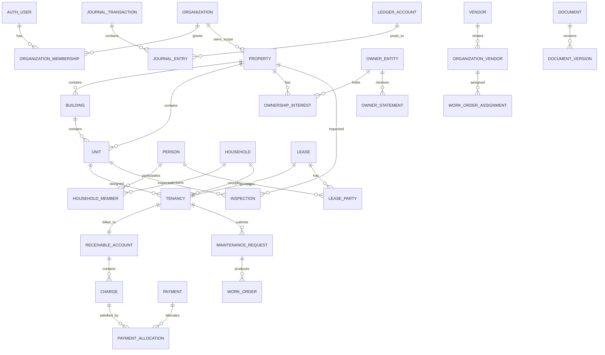

# Canonical Data Model and RLS Specification

**Purpose:** Define the launch system of record, relational invariants, tenant boundary, authorization predicates, indexes, and test obligations.

This is a logical implementation contract. The coding agent may adapt naming to an established codebase only when it preserves every invariant and documents the mapping.

---

## 1. Database conventions

### 1.1 Schemas

- `public`: application tables and security-invoker views exposed through the Supabase Data API when required
- `private`: privileged functions, provider secrets/references, worker coordination, and internal-only tables
- `audit`: append-only security and business audit records; not directly client-readable
- `reporting`: derived projections and immutable report snapshots

All exposed tables have RLS enabled. Tables are not exposed merely because they exist; grants and RLS are applied together in the same reviewed migration.

### 1.2 Identifiers

- Primary keys: UUIDv7 when supported by the project toolchain; otherwise UUID generated server-side
- Public references: human-readable, non-sequential references such as `PAY-2026-...`
- External provider IDs: stored separately and unique per provider/account
- Never expose database sequence values as access controls

### 1.3 Common columns

Organization-owned mutable tables generally include:

```text
id uuid primary key
organization_id uuid not null
created_at timestamptz not null default now()
created_by uuid null
updated_at timestamptz not null default now()
updated_by uuid null
version integer not null default 1
```

Append-only tables use `occurred_at` or `posted_at` and omit `updated_at`.

### 1.4 Money

```text
amount_minor bigint not null
currency_code char(3) not null
```

Rules:

- No floating-point money
- One functional currency per organization at launch
- Every journal transaction contains one currency
- Currency changes require organization migration, not a settings edit

### 1.5 Time and dates

- Event timestamps: UTC `timestamptz`
- Contract dates and due dates: local `date`
- Organization stores IANA time zone
- Scheduled jobs resolve local date/time through organization time zone and persist UTC execution time

### 1.6 Deletion

- Financial, legal, ownership, signature, and audit records are never cascade-deleted
- Operational child records use `ON DELETE RESTRICT` unless the parent is an uncommitted draft
- Soft deletion uses `archived_at`, not ambiguous boolean flags
- Privacy deletion anonymizes eligible personal data while preserving legally required financial and audit records

---

## 2. Core entity relationship model



---

## 3. Identity, organization, and authorization tables

### `public.profiles`

One row per authenticated user; no authorization role fields.

| Column | Type | Rule |
|---|---|---|
| `user_id` | uuid PK/FK auth.users | immutable |
| `display_name` | text | required after activation |
| `primary_phone_e164` | text | unique when present |
| `locale` | text | default `en-US` |
| `time_zone` | text | nullable |
| `status` | enum | `active`, `locked`, `merged`, `deleted` |
| `merged_into_user_id` | uuid | only when status=`merged` |

### `public.organizations`

| Column | Type | Rule |
|---|---|---|
| `id` | uuid PK | |
| `legal_name` | text | required |
| `display_name` | text | required |
| `slug` | citext | globally unique |
| `country_code` | char(2) | fixed after production activation without migration |
| `jurisdiction_package_version_id` | uuid | required before production lease generation |
| `functional_currency_code` | char(3) | fixed after first posted journal |
| `time_zone` | text | IANA |
| `status` | enum | `trial`, `active`, `suspended`, `closing`, `closed` |
| `settings` | jsonb | validated non-critical settings only |

### `public.organization_memberships`

| Column | Type | Rule |
|---|---|---|
| `id` | uuid PK | |
| `organization_id` | uuid FK | required |
| `user_id` | uuid FK auth.users | required |
| `role_code` | text FK role_definitions | required |
| `status` | enum | `invited`, `active`, `suspended`, `revoked` |
| `mfa_required` | boolean | true for privileged roles |
| `starts_at` | timestamptz | |
| `ends_at` | timestamptz | nullable |
| `invited_by` | uuid | |

Unique active membership: `(organization_id, user_id)` where status in (`invited`,`active`,`suspended`).

### `public.membership_property_scopes`

| Column | Type | Rule |
|---|---|---|
| `membership_id` | uuid FK | |
| `property_id` | uuid FK | same organization |

A membership with no property-scope rows is organization-wide only when its role definition permits organization-wide access.

### `public.role_definitions`

Global, versioned reference data. Initial roles:

- `org_owner`
- `org_admin`
- `property_manager`
- `leasing_agent`
- `accountant`
- `maintenance_coordinator`
- `read_only_auditor`

Permissions are stable codes. Role changes are versioned and never inferred from UI labels.

### `public.permission_grants`

Maps role version to permission code. Organization-specific overrides are allowed only through explicit grant/revoke records and cannot exceed plan or platform safety restrictions.

### `public.user_relationships`

Links an authenticated user to a person, owner entity, or vendor contact without granting operator membership.

| Column | Type |
|---|---|
| `user_id` | uuid |
| `organization_id` | uuid |
| `relationship_type` | enum: `resident`, `owner`, `vendor_contact` |
| `relationship_id` | uuid |
| `status` | enum |

---

## 4. Portfolio and ownership tables

### `public.properties`

Required: `organization_id`, `name`, `property_type`, `address_id`, `status`, `jurisdiction_override_id` nullable.

`property_type`: `single_family`, `multifamily`, `mixed_use`, `student_housing`, `other_residential`.

Indexes:

- `(organization_id, status)`
- `(organization_id, lower(name))`
- GIN/trigram search index on normalized name/address fields

### `public.buildings`

Optional subdivision of a property. Unique `(property_id, code)`.

### `public.units`

Required fields:

- `property_id`
- optional `building_id`
- `unit_code`
- `unit_type_id`
- `bedrooms`, `bathrooms`
- `occupancy_status` projection only
- `operational_status`: `active`, `offline`, `renovation`, `retired`

Unique `(property_id, unit_code)`.

`occupancy_status` may be cached but is never the sole source of truth; tenancy and availability records determine occupancy.

### `public.unit_availability_periods`

Tracks vacancy and hold windows. No overlapping active availability intervals for the same unit unless explicitly typed as non-exclusive marketing windows.

### `public.owner_entities`

Represents a person, company, trust, or other legal owner.

Sensitive banking and tax data are stored in private encrypted records, not general owner rows.

### `public.ownership_interests`

| Column | Rule |
|---|---|
| `property_id` | required |
| `owner_entity_id` | required |
| `ownership_fraction` | numeric(9,8), >0 and <=1 |
| `effective_from` | date |
| `effective_to` | date nullable |

Constraint: effective ownership fractions for a property should sum to 1.0 for approved periods. Enforcement occurs through a transaction command because cross-row temporal constraints are not safe as simple checks.

### `public.management_agreements`

Versioned agreement between organization and owner/property scope. Stores fee policy, reserve target, approval threshold, statement cadence, and effective dates. Signed file is a `document_version`.

---

## 5. People, households, applications, leases, and tenancy

### `public.people`

Canonical natural-person record scoped to organization. PII is minimized and classified. A person may exist without an authenticated user.

### `public.households`

A leasing and occupancy group. Status: `prospect`, `applicant`, `approved`, `resident`, `former`.

### `public.household_members`

Links person to household with relationship and responsibility flags. A household must have exactly one primary contact while active.

### `public.applications`

Required: organization, household, unit/listing context, jurisdiction version, status, submitted timestamp, decision record.

State machine:

`draft → submitted → under_review → approved | conditionally_approved | denied | withdrawn | expired`

Decision reason details are restricted to authorized staff and subject to jurisdiction policy.

### `public.leases`

Required fields:

- `organization_id`
- `property_id`
- `unit_id`
- `household_id`
- `jurisdiction_package_version_id`
- `lease_template_version_id`
- `start_date`
- `end_date` nullable for permitted month-to-month
- `status`
- `executed_at` nullable
- `supersedes_lease_id` nullable

State:

`draft → review → awaiting_signatures → executed → active → expired | terminated | superseded`

No lease can become `executed` without all required signatures and a stored immutable document hash.

### `public.lease_parties`

Links person or owner/operator signatory to lease and stores signing requirement and status.

### `public.lease_terms`

Versioned structured terms used to generate the document and financial schedule. Legal text remains in the signed document; structured terms are operational inputs.

### `public.tenancies`

Operational occupancy relationship. Required: lease, household, unit, receivable account, status, possession start/end.

State:

`scheduled → active → notice_given → move_out_in_progress → closed`

A unit cannot have overlapping active possession tenancies unless the unit/lease model explicitly supports room-level occupancy.

### `public.tenancy_member_periods`

Tracks roommate/member participation over time. This prevents rewriting historical occupants when household composition changes.

### `public.renewal_offers`, `public.lease_amendments`, `public.notices`

All are versioned, dated, linked to immutable documents when executed or served.

---

## 6. Finance and ledger tables

Detailed posting rules are in the financial specification.

### `public.ledger_accounts`

Unique `(organization_id, account_code)`. Fields: account class, normal balance, property/owner/resident dimension requirements, active dates.

### `public.journal_transactions`

Append-only header:

- organization
- transaction type
- effective date
- posted timestamp
- source type/id
- idempotency key
- currency
- correlation ID
- reversal-of transaction nullable

Unique `(organization_id, idempotency_key)`.

### `public.journal_entries`

Append-only debit/credit lines. Exactly one of `debit_minor` or `credit_minor` is positive; transaction debits equal credits.

Required dimensional columns depend on account policy:

- property_id
- unit_id
- tenancy_id
- resident_receivable_account_id
- owner_entity_id
- vendor_id

### `public.receivable_accounts`

One active account per tenancy at launch. Stores no editable balance.

### `public.charge_schedules`

Recurring schedule definition with effective dates, cadence, amount rule, due-day rule, proration policy, and jurisdiction version.

### `public.charges`

Immutable after posting except lifecycle metadata. Required: receivable account, type, due date, amount, remaining amount projection, journal transaction.

### `public.payments`

Canonical payment object independent of provider. Status: `created`, `pending`, `succeeded`, `failed`, `reversed`, `partially_refunded`, `refunded`, `disputed`.

### `public.payment_allocations`

Many-to-many payment-to-charge allocation. Sum cannot exceed available payment or charge outstanding. Allocation and unallocation use commands and journal entries.

### `public.deposits`

Deposit obligation and status. Legal custody/account fields depend on jurisdiction package. Deposit deductions require evidence and approval policy.

### `public.accounting_periods`

State: `open`, `soft_closed`, `closed`, `reopened`. Closed-period posting requires authorized reopen command and audit reason.

---

## 7. Payment and reconciliation tables

### `public.payment_attempts`

One payment may have multiple attempts. Stores method, provider connection, provider status, timestamps, and failure code.

### `private.provider_transactions`

Raw normalized provider references and signed payload hashes. Raw secrets and sensitive payload fragments remain private.

### `public.settlement_batches`

Provider/bank settlement header with gross, fees, net, currency, expected/received dates, and reconciliation status.

### `public.settlement_items`

Links settlement to provider transaction/payment and fee components.

### `public.bank_transactions`

Imported bank statement activity. Sensitive account numbers are masked; original files are private documents.

### `public.reconciliation_matches`

Links expected records to bank/settlement records with method, confidence, actor, and approval status.

### `public.reconciliation_exceptions`

Typed exception queue: missing settlement, amount mismatch, duplicate, unidentified transfer, reversed payout, chargeback, stale pending payment.

---

## 8. Maintenance, inspection, and vendor tables

### `public.maintenance_requests`

Resident/operator reported issue. Fields: property, unit, tenancy, category, priority, description, access permission, preferred times, status, SLA target.

### `public.work_orders`

Operational execution record separated from request. One request can create multiple work orders.

### `public.vendors`

Reusable legal/business identity. Not publicly searchable at launch.

### `public.organization_vendors`

Operator-specific relationship, status, service categories, internal notes, approval limits, and insurance/document status.

### `public.work_order_assignments`

Assignment period, assignee, schedule, status, acceptance, and completion.

### `public.work_order_quotes`

Quote amount, scope, expiry, evidence, approval status. Approved quote is immutable; revisions create new versions.

### `public.maintenance_costs`

Links approved cost to vendor, property accounting dimensions, owner approval, and posted journal transaction.

### `public.inspection_templates`, `inspection_template_versions`, `inspections`, `inspection_items`, `inspection_evidence`

Inspection versions are immutable after use. Evidence includes hash, capture time, uploader, and access classification.

---

## 9. Documents, communication, reporting, and operations

### `public.documents`

Logical document with category, owner organization, classification, retention policy, and linked business object.

### `public.document_versions`

Immutable version: storage path, content hash, MIME type, size, created by, signature state, effective date.

### `public.conversations`, `conversation_participants`, `messages`

Messages are append-only. Edits create revisions or tombstones according to policy. Participant access is relationship-scoped.

### `public.notification_preferences`, `private.notification_jobs`, `private.notification_deliveries`

Business domains emit semantic events; communication workers resolve templates and channels.

### `reporting.owner_statement_snapshots`

Immutable finalized statement with calculation version, period, source cutoff, totals, and document version.

### `reporting.daily_property_metrics`

Derived projection; may be rebuilt. Never used as the only source for legal or financial detail.

### `private.outbox_events`, `private.job_attempts`

Worker-only durable coordination.

### `audit.audit_events`

Append-only and partitionable by time. Sensitive before/after values are redacted or encrypted by classification.

---

## 10. Authorization functions

Privileged helper functions live in `private`, have fixed search paths, minimal grants, and explicit `auth.uid()` validation.

Required logical predicates:

```text
is_active_member(org_id, user_id)
has_permission(org_id, user_id, permission_code)
has_property_scope(org_id, user_id, property_id)
is_resident_for_tenancy(user_id, tenancy_id)
is_owner_for_property(user_id, property_id)
is_vendor_assigned_to_work_order(user_id, work_order_id)
can_read_document(user_id, document_id)
```

Do not use user-editable metadata for authorization. JWT claims may optimize coarse checks but current database membership/relationship state is authoritative for sensitive access.

## 11. Permission matrix

Legend: `R` read, `C` create, `U` controlled update, `X` explicit command, `—` denied.

| Resource/action | Org owner/admin | Property manager | Leasing agent | Accountant | Maintenance coordinator | Resident | Owner | Vendor |
|---|---:|---:|---:|---:|---:|---:|---:|---:|
| Organization settings | X | R | — | R | — | — | — | — |
| Staff/roles | X | — | — | — | — | — | — | — |
| Assigned properties/units | R/U | R/U scoped | R scoped | R scoped | R scoped | R own unit | R owned | R assigned job property minimum |
| People directory | R/U | R/U scoped | R/U scoped | limited R | limited R | own household | masked tenant summary only | minimum contact only |
| Applications | R/X | R/X scoped | R/X scoped | financial summary | — | own application | — | — |
| Draft lease | R/X | R/X scoped | R/X scoped | financial review | — | own review/sign | — | — |
| Executed lease | R | R scoped | R scoped | R | — | own | limited if agreement permits | — |
| Charges | R/X | R scoped | R scoped | R/X | — | own R | statement-level R | — |
| Payments | R/X | R scoped | R scoped | R/X | — | own C/R | statement-level R | — |
| Manual payment | X | optional X scoped | — | X | — | — | — | — |
| Reconciliation | R/X | — | — | R/X | — | — | — | — |
| Maintenance request | R/X | R/X scoped | R scoped | cost R | R/X scoped | own C/R/U limited | approval/evidence R | assigned R/U |
| Work order assignment | X | X scoped | — | cost R | X scoped | status R | approval/evidence R | accept/update assigned |
| Owner statement | R/X | R scoped | — | R/X | — | — | own R | — |
| Owner payout destination | X with step-up | — | — | X with step-up/dual approval | — | — | own request with step-up | — |
| Documents | policy | policy scoped | policy scoped | policy scoped | policy scoped | own/served | own/authorized | assigned-job docs |
| Audit history | R privileged | limited object history | limited object history | financial history | maintenance history | own activity subset | own activity subset | own job history |

Every `X` action is a server-side command with audit and authorization. A UI button is not authority.

## 12. Representative RLS policies

Conceptual examples; implementation must use project-approved helper functions and current Supabase/Postgres syntax.

### Organization-owned property read

```sql
using (
  private.has_permission(organization_id, auth.uid(), 'property.read')
  and private.has_property_scope(organization_id, auth.uid(), id)
)
```

### Resident tenancy read

```sql
using (private.is_resident_for_tenancy(auth.uid(), id))
```

### Owner statement read

```sql
using (
  private.is_owner_relationship(auth.uid(), owner_entity_id)
  and status = 'finalized'
)
```

### Vendor work-order read

```sql
using (private.is_vendor_assigned_to_work_order(auth.uid(), id))
```

Client-side direct updates to financial, lease, statement, ownership, and permission tables are denied. Changes occur through server commands using narrowly scoped privileged functions where necessary.

## 13. Index and performance requirements

At minimum:

- Every FK column used in joins has an index unless proven unnecessary
- Every organization-owned high-volume table begins indexes with `organization_id`
- Partial indexes support active/open queues
- Unique idempotency indexes exist for commands and provider events
- `charges(receivable_account_id, due_date, status)`
- `payments(organization_id, received_at desc)`
- `maintenance_requests(organization_id, status, priority, created_at)`
- `work_orders(organization_id, status, scheduled_start)`
- `outbox_events(processed_at, available_at)` partial where unprocessed
- `audit_events(organization_id, occurred_at desc)` partition candidate
- Search uses normalized generated columns or dedicated search vectors

No new index is accepted without the query it supports. No high-volume query is accepted without an execution-plan review using representative data.

## 14. Database invariant tests

Required automated tests:

1. Operator A cannot read or mutate Operator B records.
2. Property-scoped staff cannot access unassigned properties.
3. Resident cannot read another household, lease, payment, message, or maintenance request.
4. Owner cannot read resident identity documents or unrelated properties.
5. Vendor cannot enumerate other vendors or unassigned work orders.
6. UPDATE policies include both visibility and new-row validation.
7. Closed periods reject posting without approved reopen.
8. Journal transaction debits equal credits.
9. Allocation totals never exceed payment or charge availability.
10. Executed leases cannot be edited in place.
11. Finalized statements cannot be regenerated in place.
12. Duplicate provider webhook and command idempotency keys produce one business result.
13. Cross-organization foreign-key relationships are rejected by command validation and composite constraints where practical.
14. Organization currency cannot change after first posted journal.
15. Permission revocation becomes effective without waiting for a long-lived role claim refresh on sensitive commands.

## 15. Migration rules

- Use expand-and-contract migrations
- Add nullable/new structures before backfill and enforcement
- Backfills are idempotent, resumable, and measured
- Financial backfills produce reconciliation reports
- RLS policies are tested before grants reach production
- Destructive column removal occurs only after two releases with telemetry proving no reads/writes
- Every migration has rollback or forward-fix procedure
- Production migrations record expected lock duration and row count
- Schema changes are version-controlled; dashboard-only changes are forbidden
