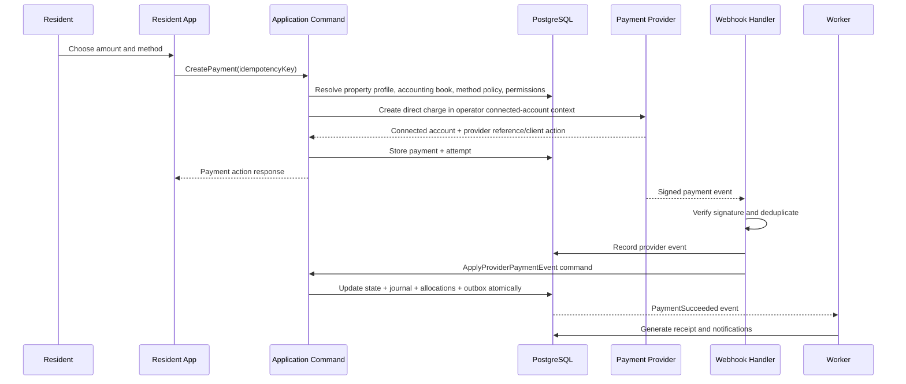

# Financial, Payment, API, Event, and Security Contracts

**Purpose:** Remove ambiguity from the most failure-sensitive parts of the platform. These contracts supersede generic CRUD behavior.

---

# Part I — Financial architecture

## 1. Accounting model

The launch system uses a double-entry general ledger with dimensions for organization, property, unit, tenancy, resident receivable account, owner, and vendor.

The ledger supports four logical subledgers:

1. Resident receivables
2. Property operations
3. Owner obligations
4. Platform SaaS billing

Platform SaaS billing is never mixed with operator property books.

## 2. Minimum chart of accounts

Account codes may be mapped to operator accounting software, but internal meaning is stable.

| Code | Account | Class | Normal balance |
|---|---|---|---|
| 1000 | Operating cash clearing | Asset | Debit |
| 1010 | Undeposited/manual payment clearing | Asset | Debit |
| 1020 | Payment provider settlement receivable | Asset | Debit |
| 1100 | Resident accounts receivable | Asset | Debit |
| 1150 | Owner receivable | Asset | Debit |
| 1200 | Security deposit asset/custody account | Asset | Debit |
| 2000 | Security deposit liability | Liability | Credit |
| 2010 | Unapplied resident cash | Liability | Credit |
| 2100 | Owner payable | Liability | Credit |
| 2150 | Vendor payable | Liability | Credit |
| 2200 | Payment dispute/chargeback reserve | Liability | Credit |
| 4000 | Rental income | Revenue | Credit |
| 4010 | Service charge income | Revenue | Credit |
| 4020 | Late fee income | Revenue | Credit |
| 4030 | Utility recovery income | Revenue | Credit |
| 4100 | Management fee income | Revenue | Credit |
| 5000 | Maintenance expense | Expense | Debit |
| 5010 | Utilities expense | Expense | Debit |
| 5020 | Tax/permit expense | Expense | Debit |
| 5030 | Payment processing fee expense | Expense | Debit |
| 5900 | Bad debt/write-off expense | Expense | Debit |

Jurisdiction or operator-specific accounts may extend this chart. Core journal templates must continue to balance.

## 3. Journal template contract

Every business command that changes financial truth maps to a reviewed journal template. Journal creation and business-state mutation commit in one database transaction.

### 3.1 Post rent charge

```text
Dr Resident accounts receivable
Cr Rental income
```

Dimensions: tenancy, unit, property, owner allocation context.

### 3.2 Receive online payment before settlement

```text
Dr Payment provider settlement receivable
Cr Resident accounts receivable            [allocated amount]
Cr Unapplied resident cash                  [unallocated amount]
```

Provider processing fee is recognized according to the selected flow-of-funds and accounting policy, not guessed from the gross payment event.

### 3.3 Receive manual bank/cash payment

```text
Dr Undeposited/manual payment clearing
Cr Resident accounts receivable            [allocated amount]
Cr Unapplied resident cash                  [unallocated amount]
```

A later deposit/reconciliation moves clearing to the approved cash account.

### 3.4 Provider settlement

```text
Dr Operating cash clearing                  [net received]
Dr Payment processing fee expense           [provider fee]
Cr Payment provider settlement receivable   [gross expected]
```

Mismatch creates a reconciliation exception and cannot be silently forced.

### 3.5 Refund

Reverse the original economic effect through a new journal transaction. Never delete or reduce the original journal lines.

### 3.6 Payment reversal or chargeback

```text
Dr Resident accounts receivable or dispute receivable
Cr Operating cash / provider settlement receivable
```

If the resident balance is not legally collectible, an authorized write-off follows as a separate decision.

### 3.7 Security deposit receipt

Reference default when the operator has custody:

```text
Dr Approved deposit cash/custody account
Cr Security deposit liability
```

The actual account segregation and interest rules are jurisdiction-blocked decisions.

### 3.8 Deposit deduction

```text
Dr Security deposit liability
Cr Resident accounts receivable or approved recovery income
```

Requires documented evidence, notice, approval, and jurisdiction rule.

### 3.9 Maintenance vendor cost

```text
Dr Maintenance expense
Cr Vendor payable or operating cash
```

### 3.10 Owner payable recognition

At statement finalization or approved cadence:

```text
Dr Rental income / owner distribution clearing according to accounting policy
Cr Owner payable
```

The exact property-management accounting presentation is configurable but must reconcile from property income, expenses, reserves, and management fees.

### 3.11 Owner remittance record

```text
Dr Owner payable
Cr Operating cash clearing
```

Automated payment execution is disabled until approved; manual remittance evidence may post this transaction after reconciliation.

## 4. Charge contract

A charge contains:

- type and source
- service period
- due date
- amount and currency
- jurisdiction/rule version
- receivable account
- property/unit/tenancy dimensions
- posted journal transaction
- status: `posted`, `partially_paid`, `paid`, `credited`, `written_off`, `reversed`

Posted charge principal is immutable. Correction uses credit/reversal and a new charge.

## 5. Recurring schedule contract

A recurring schedule must define:

- effective start/end
- cadence
- due-date rule
- amount or approved formula
- proration policy
- grace/late-fee policy reference
- time zone
- next generation date
- idempotency namespace

Charge generation is safe to rerun. The unique key is based on schedule, service period, and charge type.

## 6. Payment allocation contract

Allocation rules:

1. Allocation is explicit and recorded per charge.
2. Sum of active allocations cannot exceed succeeded, non-refunded payment amount.
3. Sum allocated to a charge cannot exceed its collectible outstanding amount.
4. Automatic allocation order is organization-configurable within jurisdiction limits.
5. Changing an allocation after a closed period requires authorized adjustment entries.
6. Unapplied cash remains visible and is not treated as revenue.

## 7. Accounting close

- `open`: ordinary posting allowed
- `soft_closed`: ordinary users blocked; authorized accountant adjustments allowed
- `closed`: posting blocked
- `reopened`: temporary state with approver, reason, and expiry

Finalized owner statements identify their cutoff timestamp and accounting period version. Reopening a period does not mutate an already-issued statement; it produces an adjustment statement or replacement version with explicit history.

---

# Part II — Payment and reconciliation architecture

## 8. Approved payment-orchestration posture

The platform owns orchestration and canonical rental accounting; licensed payment providers own payment execution, KYC, merchant balance, and settlement.

For eligible United States, Canadian, and Mexican operators using Stripe:

- create or link a connected account with full Stripe Dashboard access;
- use Stripe-hosted onboarding and KYC;
- create resident rent payments as direct charges in the connected-account context;
- configure the connected account as fee payer where supported, equivalent to Standard account behavior;
- settle directly to the operator's approved bank account;
- collect only a disclosed application fee when the country profile and pricing decision permit it;
- query and reconcile PaymentIntents, Charges, disputes, refunds, and settlements using the connected-account identifier;
- never infer success from a browser redirect.

Country payment targets:

| Country | Currency | Initial methods | Important state behavior |
|---|---|---|---|
| United States | USD | ACH debit and cards | ACH is delayed and may return; cards support disputes |
| Canada | CAD | ACSS pre-authorized debit and cards | PAD mandates are required; delayed confirmation and returns must remain visible |
| Mexico | MXN | SPEI-backed bank transfer and cards | bank transfers can underpay/overpay and require customer-balance reconciliation |

OXXO may be enabled for selected Mexican obligations only after product limits, refund behavior, resident UX, and fee treatment are approved.

Security deposits have a distinct obligation type and method policy. A method that can collect rent is not automatically allowed to collect a deposit.

## 9. Merchant connection lifecycle

```text
draft
 → onboarding_started
 → requirements_due
 → capabilities_pending
 → active
 → restricted | suspended
 → closed
```

Activation requires the country profile, provider country support, currency, charge capability, payouts capability, fee-payer policy, and account ownership to be verified.

## 10. Payment state machine

```text
created
 → awaiting_action
 → processing
 → succeeded
 → partially_refunded
 → refunded

created/awaiting_action/processing → failed | cancelled
succeeded → disputed | reversed
```

Provider events may arrive late or out of order. State transitions use provider event time, provider sequence when available, and allowed transition rules.

## 11. Payment command sequence



The browser never marks a payment succeeded. Redirect success pages are informational until the verified provider event or authoritative provider query is processed.

## 12. Webhook contract

Every inbound webhook handler must:

1. Read raw request body.
2. Verify provider signature and timestamp.
3. Reject unsupported environment, provider account, country profile, or operating-entity mapping.
4. Store event ID, type, timestamp, payload hash, and processing state.
5. Deduplicate with a unique `(provider, connected_account, provider_event_id)` key.
6. Acknowledge within the provider’s recommended timeout.
7. Process asynchronously when work exceeds acknowledgement budget.
8. Support safe replay from the control plane.
9. Never log secrets or full sensitive payloads.

## 13. Idempotency contract

Idempotency is required for:

- create payment
- record manual payment
- refund
- reverse payment
- generate charge
- execute lease
- finalize statement
- provider event application
- notification side effects
- export/sync jobs

An idempotency record stores actor, organization, command name, normalized request hash, result reference, status, and expiry. Reusing a key with a different request hash returns `IDEMPOTENCY_CONFLICT`.

## 14. Reconciliation process

```text
Expected payment/provider transaction
  ↕
Provider settlement item
  ↕
Bank transaction
  ↕
Operator cash account
```

Matching methods:

- exact provider reference
- exact amount/date/account
- imported bank reference
- approved manual match

Automatic low-confidence matches are proposals, not final records. Exceptions remain in an accountant queue until resolved, waived with authority, or escalated.

## 15. Manual payment controls

Manual cash or bank-transfer recording requires:

- permission `payment.manual_record`
- organization, operating entity, accounting book, property profile, and tenancy context
- method
- amount/currency
- received date
- payer/reference
- evidence or explicit reason when evidence unavailable
- receipt creation
- audit event
- optional second approval above configured threshold

A manual payment is not considered deposited/settled until reconciliation policy confirms it.

---

# Part III — API contracts

## 16. API style

- Server-side application commands for mutations
- Permission-filtered query endpoints/server actions for reads
- Versioned public API only when an external integration is approved
- JSON request/response with stable error envelope
- Idempotency header for retriable commands
- Correlation ID returned on every request

## 17. Error envelope

```json
{
  "error": {
    "code": "PAYMENT_ALLOCATION_EXCEEDS_AVAILABLE",
    "message": "The allocation exceeds the available payment amount.",
    "field_errors": [],
    "retryable": false,
    "correlation_id": "..."
  }
}
```

Required error families:

- `AUTH_*`
- `PERMISSION_*`
- `VALIDATION_*`
- `CONFLICT_*`
- `STATE_TRANSITION_*`
- `FINANCE_*`
- `PAYMENT_*`
- `PROVIDER_*`
- `RATE_LIMIT_*`
- `INTERNAL_*`

User-facing messages must not reveal cross-tenant object existence.

## 18. Required launch commands

### Organization and access

- `CreateOrganization`
- `InviteMembership`
- `ChangeMembershipRole`
- `SetMembershipPropertyScope`
- `RevokeMembership`
- `BeginSupportSession`

### Portfolio and people

- `CreateProperty`
- `CreateUnit`
- `ArchiveUnit`
- `CreatePerson`
- `CreateHousehold`
- `LinkOwnerInterest`
- `CreateManagementAgreement`

### Leasing

- `CreateApplication`
- `ApproveApplication`
- `CreateLeaseDraft`
- `GenerateLeaseDocument`
- `SendLeaseForSignature`
- `ApplySignatureEvent`
- `ExecuteLease`
- `ActivateTenancy`
- `CreateRenewalOffer`
- `RecordNotice`
- `CompleteMoveOut`

### Finance and payments

- `CreateChargeSchedule`
- `GenerateCharges`
- `PostManualCharge`
- `CreatePayment`
- `ApplyProviderPaymentEvent`
- `RecordManualPayment`
- `AllocatePayment`
- `RefundPayment`
- `ReversePayment`
- `CreateDepositDeduction`
- `CloseAccountingPeriod`
- `ReopenAccountingPeriod`
- `FinalizeOwnerStatement`
- `RecordOwnerRemittance`

### Maintenance and inspection

- `SubmitMaintenanceRequest`
- `TriageMaintenanceRequest`
- `CreateWorkOrder`
- `AssignWorkOrder`
- `SubmitVendorQuote`
- `ApproveMaintenanceExpense`
- `CompleteWorkOrder`
- `CreateInspection`
- `FinalizeInspection`

## 19. Example command contract

### `RecordManualPayment`

**Input**

```json
{
  "organization_id": "uuid",
  "tenancy_id": "uuid",
  "amount_minor": 125000,
  "currency_code": "USD",
  "method": "bank_transfer",
  "received_on": "2026-07-18",
  "external_reference": "ABC-123",
  "evidence_document_version_id": "uuid",
  "allocation_strategy": "oldest_due_first"
}
```

**Preconditions**

- active organization
- actor has permission and property scope
- currency matches organization
- tenancy receivable account is active or authorized former account
- accounting period open
- duplicate reference policy passes

**Atomic writes**

- payment
- payment attempt/manual source record
- allocations
- balanced journal transaction
- audit event
- outbox events

**Events**

- `payment.manual_recorded.v1`
- `payment.succeeded.v1`
- `resident.balance_changed.v1`

**Failure codes**

- `PERMISSION_DENIED`
- `CURRENCY_MISMATCH`
- `ACCOUNTING_PERIOD_CLOSED`
- `DUPLICATE_PAYMENT_REFERENCE`
- `ALLOCATION_EXCEEDS_AVAILABLE`

---

# Part IV — Domain event catalog

## 20. Event envelope

```json
{
  "event_id": "uuid",
  "event_type": "payment.succeeded.v1",
  "organization_id": "uuid",
  "aggregate_type": "payment",
  "aggregate_id": "uuid",
  "occurred_at": "2026-07-18T20:00:00Z",
  "actor": {"type": "user", "id": "uuid"},
  "correlation_id": "uuid",
  "data": {}
}
```

Event payloads contain identifiers and essential state, not unnecessary PII.

## 21. Required event families

### Organization

- `organization.created.v1`
- `membership.invited.v1`
- `membership.revoked.v1`
- `entitlement.changed.v1`

### Leasing

- `application.submitted.v1`
- `application.decided.v1`
- `lease.sent_for_signature.v1`
- `lease.executed.v1`
- `tenancy.activated.v1`
- `renewal.offer_created.v1`
- `tenancy.notice_recorded.v1`
- `tenancy.closed.v1`

### Finance/payment

- `charge.posted.v1`
- `charge.overdue.v1`
- `payment.created.v1`
- `payment.succeeded.v1`
- `payment.failed.v1`
- `payment.refunded.v1`
- `payment.disputed.v1`
- `settlement.received.v1`
- `reconciliation.exception_created.v1`
- `accounting_period.closed.v1`
- `owner_statement.finalized.v1`

### Maintenance/inspection

- `maintenance.request_submitted.v1`
- `maintenance.request_triaged.v1`
- `work_order.assigned.v1`
- `work_order.completed.v1`
- `maintenance.expense_approved.v1`
- `inspection.finalized.v1`

### Documents/communications

- `document.version_created.v1`
- `document.signed.v1`
- `notification.requested.v1`
- `message.sent.v1`

---

# Part V — Security and privacy threat model

## 22. Trust boundaries

1. Unauthenticated public pages
2. Authenticated browser/PWA
3. Application server
4. Database and private functions
5. Worker/queue runtime
6. Object storage
7. Payment and e-sign providers
8. Platform support/control plane
9. Imported files and external APIs

## 23. Protected assets

- resident and owner identity data
- leases and notices
- payment and bank references
- deposits
- owner payout destinations
- ledger history
- property-access instructions
- inspection and interior-property images
- authentication sessions
- provider secrets
- audit records

## 24. Priority abuse cases and controls

| Threat | Example | Mandatory controls |
|---|---|---|
| Cross-tenant access | Staff changes URL to another organization’s lease | RLS, scoped queries, non-enumerable IDs, negative tests |
| Privilege escalation | Manager edits role metadata | DB membership authority, command-only role changes, MFA, audit |
| Resident data exposure to owner | Owner downloads identity document | document classification, owner-specific policy, masked views |
| Vendor overreach | Vendor enumerates properties | assignment-scoped RLS, minimum contact data |
| Payment webhook spoofing | Attacker sends success event | raw-body signature verification, provider account validation, event dedupe |
| Duplicate financial posting | Provider retries event | idempotency unique keys and transactional command |
| Manual payment fraud | Staff records nonexistent cash | permission, evidence, receipt, optional dual approval, reconciliation queue |
| Payout destination takeover | Attacker changes owner bank account | step-up auth, dual approval, notification, payout hold, audit |
| Support abuse | Employee impersonates operator | approved time-limited support session, reason, visible banner, restricted actions |
| Document URL leakage | Shared signed URL exposes lease | private bucket, short-lived scoped URLs, access log |
| Malicious upload | Executable or oversized file | allowlist, size limit, malware scanning, content sniffing |
| Mass scraping | Attacker enumerates public vacancies | rate limiting, bot controls, no private data in public response |
| Queue replay | Old event repeats email or payment action | consumer idempotency, event version, side-effect key |
| Stale authorization | Revoked staff retains JWT role | current DB checks on sensitive commands, short sessions for privileged users |
| SQL/function privilege abuse | Public security-definer function bypasses RLS | private schema, revoked PUBLIC execute, fixed search path, explicit caller checks |
| Data export abuse | User exports entire portfolio | permission, scope, async job, watermark/log, retention and download expiry |

Additional mandatory abuse cases:

- connecting one landlord's merchant account to another organization;
- changing property jurisdiction to unlock an otherwise prohibited fee or payment method;
- enabling online deposit collection into an ordinary rent account;
- replaying a connected-account webhook against the wrong operating entity;
- using an application fee or resident surcharge not approved by the active country profile;
- masking a delayed ACH/PAD/bank-transfer state as settled.

## 25. Authentication controls

- MFA mandatory for organization owner/admin, accountant, and platform support
- Step-up authentication for role changes, payout destinations, refunds above threshold, period reopening, and sensitive document reveal
- Session list and remote revocation
- Shorter privileged-session duration
- Rate limiting and bot protection on authentication and public forms
- Passwordless and password flows may be supported, but recovery changes are audited

## 26. Data classification

| Class | Examples | Handling |
|---|---|---|
| Public | shareable listing content | public cache permitted after moderation rules |
| Internal | operator settings, ordinary maintenance metadata | authenticated and scoped |
| Confidential | leases, statements, resident contact data | private storage, scoped access, logs |
| Restricted | IDs, bank details, payout destinations, provider secrets | encrypted/masked, step-up reveal, least privilege |

## 27. Privacy operations

The platform must support:

- consent and notice records
- access/export request
- correction request
- deletion/anonymization request
- legal hold
- retention-policy execution
- sensitive-access history

Financial and legal records are retained or anonymized according to jurisdiction; deletion does not erase required audit truth.

## 28. Security verification gates

Before production:

- automated RLS cross-tenant suite passes
- dependency and secret scans pass
- webhook signature and replay tests pass
- upload validation tests pass
- support impersonation is audited and restricted
- owner payout change workflow is penetration-tested if enabled
- threat model is reviewed after final payment flow selection
- external penetration test is scheduled before material payment volume
